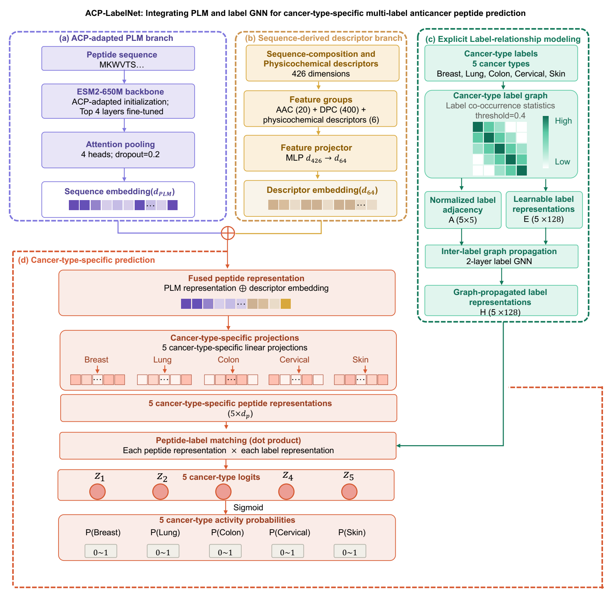
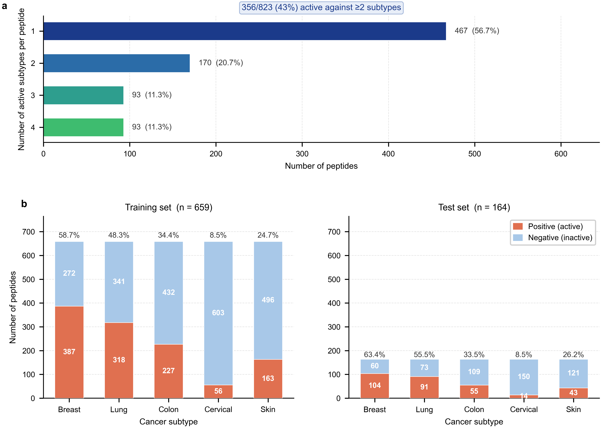

# ACP-LabelNet

This repository provides the code for **“ACP-LabelNet: Integrating pLM and label GNN for cancer-type-specific multi-label anticancer peptide prediction”**.

ACP-LabelNet is a two-stage framework. Stage 1 adapts a pretrained protein language model to binary anticancer-peptide (ACP) recognition. Stage 2 transfers that representation to joint prediction of activity against breast, lung, colon, cervical, and skin cancers. The Stage 2 model combines ESM2 residue representations with explicit sequence features and a graph of cancer-label relationships.

This repository intentionally contains only the code and processed data needed to reproduce the main training pipeline. Development scripts, ablations, plotting notebooks, scheduler files, logs, caches, and intermediate checkpoints are excluded.

## Method overview

[](assets/acp_labelnet_framework.pdf)

*Overview of the ACP-LabelNet framework. Click the figure to open the original PDF.*

The reported Stage 2 configuration uses:

- ESM2-650M (`facebook/esm2_t33_650M_UR50D`) with the upper four Transformer layers fine-tuned;
- single-query, four-head attention pooling;
- 426 handcrafted features: 20 amino-acid composition, 400 dipeptide composition, and 6 physicochemical descriptors;
- a `426 -> 64` handcrafted-feature projection;
- five 128-dimensional label nodes and a two-layer label GCN;
- conditional co-occurrence edges thresholded at 0.4, estimated separately inside each training fold;
- asymmetric loss, GradNorm task balancing, and training-only augmentation of cervical-positive peptides.

The highest trainable backbone layer uses a learning rate of `1e-5`; lower trainable layers use a 0.9 layer-wise decay. The general head learning rate is `5e-4`, and the cancer-specific sequence projections use `2e-4`.



## Repository layout

```text
├── acp_labelnet/
│   ├── config.py       # public experiment configuration
│   ├── data.py         # datasets, features, folds, and augmentation
│   ├── losses.py       # asymmetric loss and GradNorm
│   ├── metrics.py      # metrics and validation threshold selection
│   ├── model.py        # attention pool, Stage 1 model, and ACP-LabelNet
│   └── training.py     # optimization and reproducibility utilities
├── scripts/
│   ├── train_stage1_kfold.py
│   └── train_stage2_kfold.py
├── data/
│   ├── stage1/         # Set 1 and Set 2 binary ACP benchmarks
│   └── stage2/         # 659-development / 164-independent-test benchmark
├── assets/             # figures reproduced from the manuscript
├── requirements.txt
└── README.md
```

## Installation

Python 3.10 or later is recommended. Create a clean environment and install the minimal dependencies:

```bash
python -m venv .venv
source .venv/bin/activate
python -m pip install --upgrade pip
python -m pip install -r requirements.txt
```

The first run downloads ESM2-650M from Hugging Face unless `--backbone` points to a local model directory. The manuscript experiments used one NVIDIA A100 GPU with 80 GB memory. If host memory is constrained, set `--num-workers 0`; changing batch size may change optimization behavior and should be reported.

## Pretrained checkpoints

The pretrained Stage 1 and fold-specific Stage 2 checkpoints used in the article will be provided through Google Drive:

**Google Drive:** [Download ACP-LabelNet checkpoints](https://drive.google.com/drive/folders/1_89y4kRLXF7SDd6hwULRhWUbrpDT5h70?usp=drive_link)

After downloading and extracting the archive, place the files under `outputs/checkpoints/`:

```text
outputs/checkpoints/
├── stage1_set2_best.pt
├── stage2_fold0.pt
├── stage2_fold1.pt
├── stage2_fold2.pt
├── stage2_fold3.pt
└── stage2_fold4.pt
```

The Stage 1 checkpoint can be passed explicitly when training Stage 2:

```bash
python scripts/train_stage2_kfold.py \
  --fold 0 \
  --stage1-checkpoint outputs/checkpoints/stage1_set2_best.pt
```

The Google Drive archive is provided for result verification and downstream use. All checkpoints correspond to the public ESM2-650M backbone identifier and the architecture implemented in this repository.

## Reproduce Stage 1

Stage 2 is initialized from the validation-selected Stage 1 Set 2 checkpoint. Train all five Set 2 folds:

```bash
for fold in 0 1 2 3 4; do
  python scripts/train_stage1_kfold.py --dataset set2 --fold "$fold"
done

python scripts/train_stage1_kfold.py --dataset set2 --aggregate-only
```

This creates `outputs/checkpoints/stage1_set2_best.pt`. The selected fold is determined only by Stage 1 validation F1. Set 1 can be run by replacing `set2` with `set1`; it is not needed for Stage 2 initialization.

For a short code-path check, use one fold and one epoch:

```bash
python scripts/train_stage1_kfold.py \
  --dataset set2 --fold 0 --epochs 1 --num-workers 0
```

## Reproduce Stage 2

After Stage 1 aggregation, train the five cancer-type-specific folds:

```bash
for fold in 0 1 2 3 4; do
  python scripts/train_stage2_kfold.py --fold "$fold"
done

python scripts/train_stage2_kfold.py --aggregate-only
```

Each fold uses four development folds for fitting and one for checkpoint and threshold selection. Its fixed validation-derived thresholds are then applied once to the independent test set. Outputs include:

- `outputs/checkpoints/stage2_fold{0..4}.pt`;
- `outputs/results/stage2_fold{0..4}.json`;
- compressed independent-test probabilities for verification;
- `outputs/results/stage2_summary.json` with the mean and population standard deviation across folds.

To use an already available Stage 1 checkpoint or a local ESM2 copy:

```bash
python scripts/train_stage2_kfold.py \
  --fold 0 \
  --stage1-checkpoint /path/to/stage1_set2_best.pt \
  --backbone /path/to/esm2_t33_650M_UR50D
```

## Evaluation protocol

The code enforces the protocol described in the manuscript:

1. Original Stage 1 train/test partitions are retained.
2. The Stage 2 benchmark is fixed at 659 development and 164 independent-test peptides.
3. Development data are divided into five folds with stratification on the minority cervical label.
4. Augmentation and label-graph estimation use the fitting portion of a fold only.
5. Checkpoint selection uses the harmonic mean of validation macro-F1 and the lowest validation cancer-type F1.
6. Cancer-type thresholds maximize Youden's J on the validation fold.
7. The independent test set is not used for fitting, checkpoint selection, graph construction, or threshold selection.
8. Five fold-specific models are evaluated separately; no test-time ensemble is used.

## Main reported result

Across the five fold-trained models evaluated on the same independent test set, ACP-LabelNet achieved a macro-F1 of **68.89 ± 1.94%**. Cancer-type F1 values were 78.52 ± 1.46% (breast), 76.53 ± 5.34% (lung), 74.19 ± 1.52% (colon), 47.38 ± 7.73% (cervical), and 67.83 ± 2.47% (skin).

## Data

Stage 1 contains the two ACP-recognition benchmarks distributed with ACP-CapsPred. Stage 2 integrates experimentally validated records from CancerPPD2 and DCTPep, merges identical sequences while retaining all cancer-type annotations, removes non-standard or out-of-range sequences, and applies CD-HIT at 90% identity. The final Stage 2 benchmark contains 823 non-redundant peptides. See [data/README.md](data/README.md) for file schemas and counts.

## Reproducibility notes

- Random seeds are fixed for Python, NumPy, and PyTorch.
- Fold assignments are deterministic (`fold_seed=0`).
- The public model identifier replaces the private cluster path used during development.
- Pretrained checkpoints are distributed separately through the Google Drive link above because the ESM2-650M checkpoint files are too large for the source repository.
- The repository does not contain raw database dumps. It contains only the processed benchmark tables used by the scripts.

## Citation

If you use this repository, please cite the ACP-LabelNet manuscript. The final journal citation and DOI will be added after publication.

## Contact

For questions about the code or benchmark, contact the corresponding authors listed in the manuscript.
